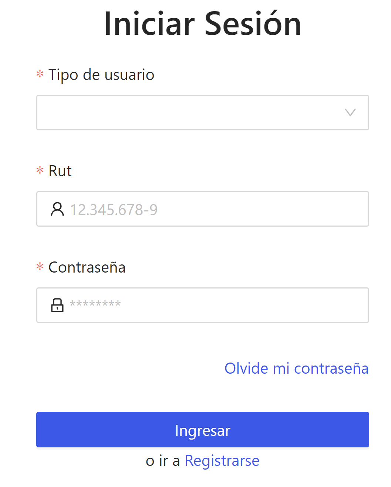

# Sistema de gestión curricular - Frontend

## Requisitos previos a la instalación.

Se debe tener instalado NodeJS para la ejecución y buildeo de proyecto, en este caso se utilizó la version 16.16.0.

Crear archivo .env en la raiz del proyecto. El archivo .env debe contener los siguientes parametros.

`
SERVER_PORT: *Puerto del backend
SERVER_URL: *URL del backend
`

## Instalación

- Instalar las dependencias del proyecto ingresando el comando `npm run install`

- Buildear la aplicación con el comando `npm run build`

- Ejecutar el comando `node server.js` en la raiz del proyecto.

## Login

Si todo a salido bien, se deberia ver como primer vistazo el login de la aplicación
